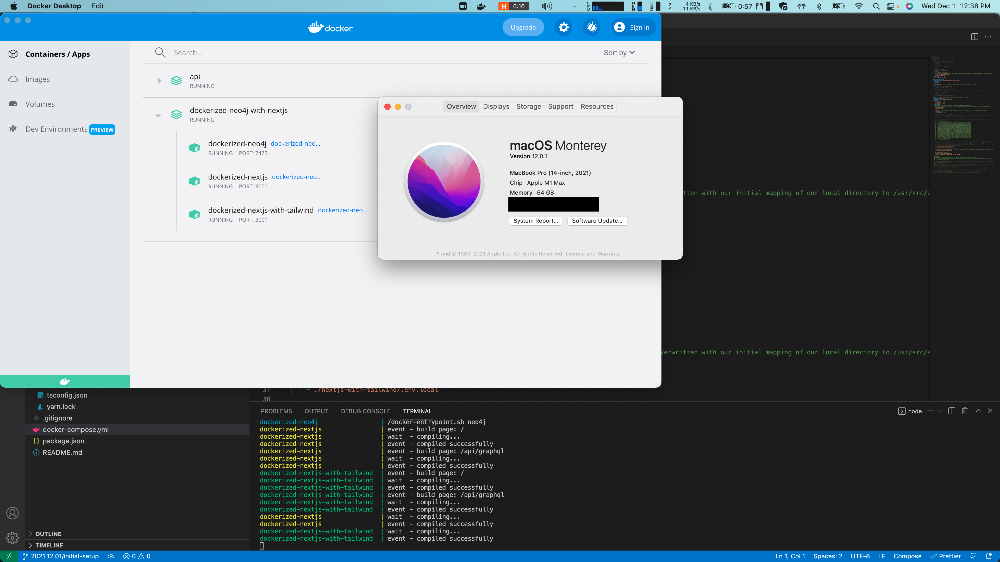
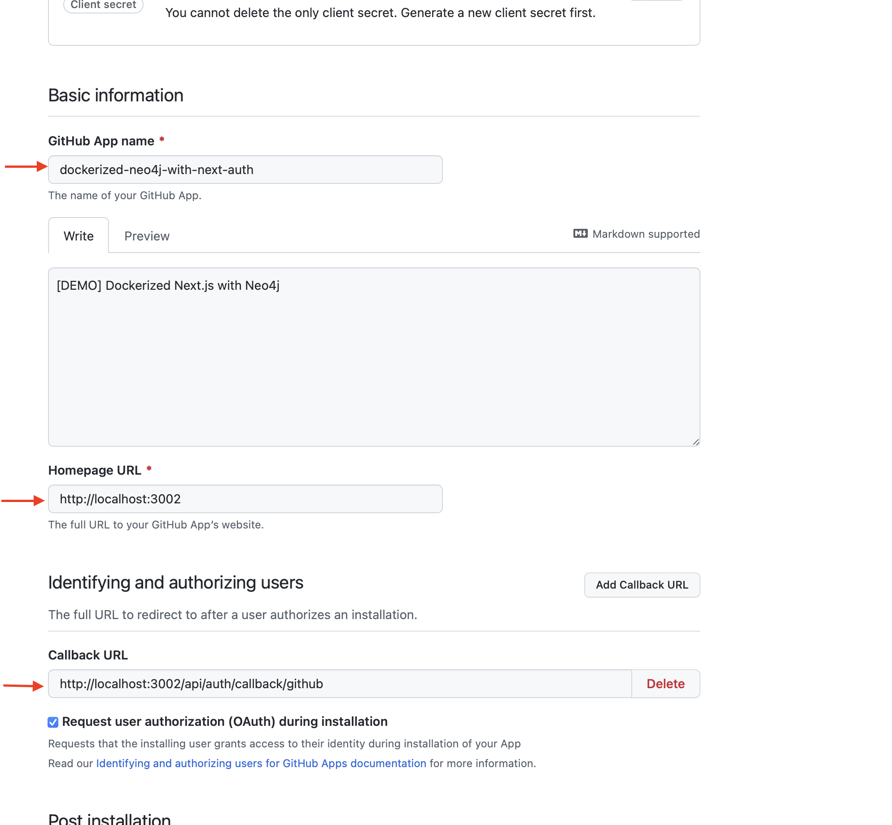
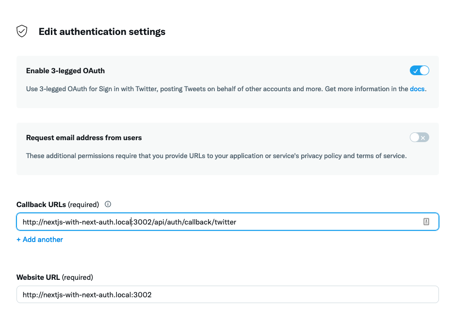
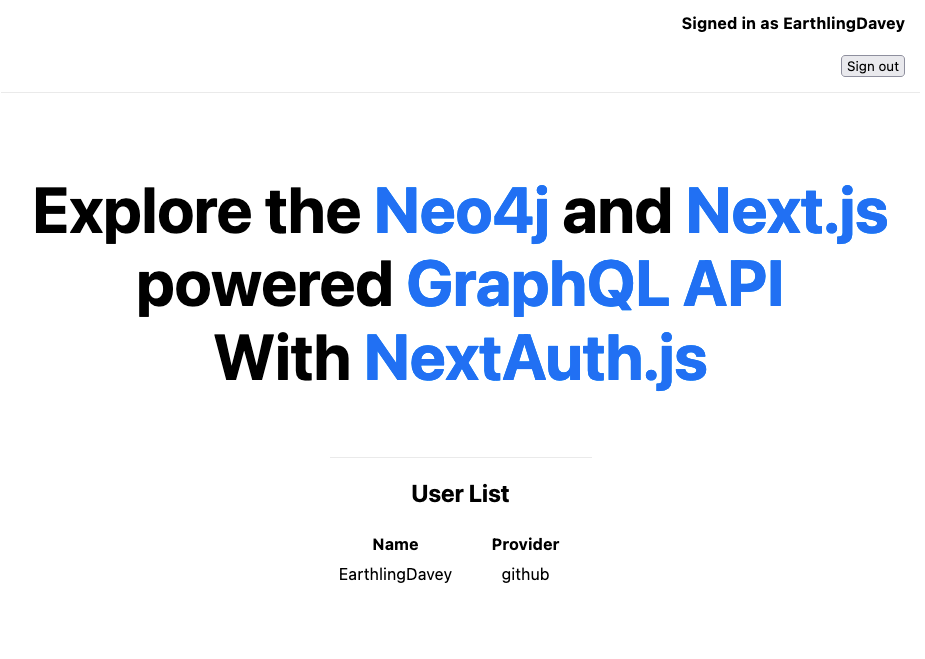

# Welcome

This project is a simple example of how to work with [Neo4j](https://neo4j.com) within a [Docker](https://www.docker.com) container.

I have also updated this project to support development on my new 2021 14" MacBook Pro - with commented out lines in `Dockerfile` when it is necessary to use a separate base image for development on Apple M1 silicon:



Neo4j `Dockerfile` example:

```
# neo4j/v4.x.x/Dockerfile

# Official Neo4j Docker Images available at https://hub.docker.com/_/neo4j
# FROM neo4j:4.2.2

# OPTIONAL: For arm64 (M1 Macs), comment out the previous line and uncomment the following line.
FROM neo4j/neo4j-arm64-experimental:4.3.6-arm64
```

All you need to have installed on your system to run this example is [Docker](https://www.docker.com).

If you do not have [Docker](https://www.docker.com) installed on your development system, you can download and install the freely available [Docker Desktop](https://www.docker.com/products/docker-desktop).

## Getting started

**IMPORTANT: Before starting this project, please be sure to copy `nextjs/.env.sample` to `nextjs/.env.local` and to copy `nextjs-with-tailwind/.env.sample` to `nextjs-with-tailwind/.env.local`**

To spin up your Dockerized Neo4j and Next.js project:

```sh
# Use the existing Docker images on your system
$ npm run dev

# OR #

# Force a clean build to ensure your instances are using the latest code
$ npm run dev:clean
```

### Neo4j

Once you have started your Dockerized project, you can access the Neo4j Browser at [http://localhost:7474/browser/](http://localhost:7474/browser/) - using the following credentials:

- Username: `neo4j`
- Password: `letmein`


Once you've logged in, you are free to explore your Dockerized Neo4j instance.


#### OPTIONAL: Use Cypher text file(s) to seed your database

If you would like to have your database load a pre-defined series of Cypher commands - such as the example at `neo4j/v4.x.x/__seed__/db.cypher` - uncomment the following in `neo4j/v4.x.x/Dockerfile`:

```sh
# neo4j/v4.x.x/Dockerfile

...
# COPY ./__seed__/*.cypher /var/lib/neo4j/import/
...

```

This will ensure that your Cypher file(s) are copied and then processed by the `neo4j/v4.x.x/wrapper.sh` script when building your Neo4j instance.

### Next.js

An example [Next.js](https://nextjs.org) application has been created so that we can use the [Neo4j GraphQL Library](https://neo4j.com/docs/graphql-manual/current/) to create our GraphQL API.

Once you have started your Dockerized project, you can access the Next.js GraphQL API at [http://localhost:3000/api/graphql](http://localhost:3000/api/graphql)

#### EXAMPLE: Create a query to verify our GraphQL API is online

Let's use the `ping` query that we have defined in our GraphQL schema:

```gql
{
  ping {
    message
    timestamp
  }
}
```

You should see a response similar to:

```json
{
  "data": {
    "ping": {
      "message": "Pong",
      "timestamp": "2021-09-05T02:23:55.000Z"
    }
  }
}
```


#### EXAMPLE: Create a new User

To create a new `User` using our GraphQL API, we will use the `createUsers` mutation that was automatically created for us with the [Neo4j GraphQL Library](https://neo4j.com/docs/graphql-manual/current/):

```gql
mutation {
  createUsers(input: { username: "therobbrennan" }) {
    users {
      username
      created
    }
  }
}
```

You should see a response similar to:

```json
{
  "data": {
    "createUsers": {
      "users": [
        {
          "username": "therobbrennan",
          "created": "2021-09-05T02:24:54.078Z"
        }
      ]
    }
  }
}
```


**IMPORTANT: This mutation will allow you to create duplicate users if you have not defined the appropriate constraint within your Neo4j database!**

If you would like to prevent duplicate `User` nodes from being created with the same `username`, for example, you can log in to the Neo4j Browser at [http://localhost:7474/browser/](http://localhost:7474/browser/) and execute the following Cypher command:

`CREATE CONSTRAINT ON (node:User) ASSERT (node.username) IS UNIQUE;`

#### EXAMPLE: Query all of the users in our database

In this example, let's count how many `User` nodes exist in our Neo4j database - and see each user's `username` and `created` details:

```gql
{
  usersCount
  users {
    username
    created
  }
}
```

You should see a response similar to:

```json
{
  "data": {
    "usersCount": 1,
    "users": [
      {
        "username": "therobbrennan",
        "created": "2021-09-05T02:24:54.078Z"
      }
    ]
  }
}
```


### Next.js with Tailwind CSS

An example [Next.js](https://nextjs.org) application with [Tailwind CSS](https://tailwindcss.com) has been created so that we can use the [Neo4j GraphQL Library](https://neo4j.com/docs/graphql-manual/current/) to create our GraphQL API.

Once you have started your Dockerized project, you can access the Next.js GraphQL API at [http://localhost:3001/api/graphql](http://localhost:3001/api/graphql)

#### EXAMPLE: Create a query to verify our GraphQL API is online

Let's use the `ping` query that we have defined in our GraphQL schema:

```gql
{
  ping {
    message
    timestamp
  }
}
```

You should see a response similar to:

```json
{
  "data": {
    "ping": {
      "message": "Pong",
      "timestamp": "2021-09-05T02:23:55.000Z"
    }
  }
}
```


#### EXAMPLE: Create a new User

To create a new `User` using our GraphQL API, we will use the `createUsers` mutation that was automatically created for us with the [Neo4j GraphQL Library](https://neo4j.com/docs/graphql-manual/current/):

```gql
mutation {
  createUsers(input: { username: "therobbrennan" }) {
    users {
      username
      created
    }
  }
}
```

You should see a response similar to:

```json
{
  "data": {
    "createUsers": {
      "users": [
        {
          "username": "therobbrennan",
          "created": "2021-09-05T02:24:54.078Z"
        }
      ]
    }
  }
}
```


**IMPORTANT: This mutation will allow you to create duplicate users if you have not defined the appropriate constraint within your Neo4j database!**

If you would like to prevent duplicate `User` nodes from being created with the same `username`, for example, you can log in to the Neo4j Browser at [http://localhost:7474/browser/](http://localhost:7474/browser/) and execute the following Cypher command:

`CREATE CONSTRAINT ON (node:User) ASSERT (node.username) IS UNIQUE;`

#### EXAMPLE: Query all of the users in our database

In this example, let's count how many `User` nodes exist in our Neo4j database - and see each user's `username` and `created` details:

```gql
{
  usersCount
  users {
    username
    created
  }
}
```

You should see a response similar to:

```json
{
  "data": {
    "usersCount": 1,
    "users": [
      {
        "username": "therobbrennan",
        "created": "2021-09-05T02:24:54.078Z"
      }
    ]
  }
}
```


### Next.js with next-auth

An example [Next.js](https://nextjs.org) application with [NextAuth.js](https://next-auth.js.org) has been created by [EarthlingDavey](https://github.com/EarthlingDavey) so that we can use the [Neo4j GraphQL Library](https://neo4j.com/docs/graphql-manual/current/) for our GraphQL API.

1. Some auth providers (e.g. twitter) don't work with a localhost callback url  
   If using twitter, set up a .local domain e.g. `http://nextjs-with-next-auth.local`  
   A cross-platform guide for this is at:
   [Using an /etc/hosts file for custom domains during development](https://support.acquia.com/hc/en-us/articles/360004175973-Using-an-etc-hosts-file-for-custom-domains-during-development)
1. Create apps with your providers.
   Follow the [GitHub guide](https://next-auth.js.org/providers/github), for example, on the [NextAuth.js docs](https://next-auth.js.org/getting-started/introduction).
   This demo has been made with GitHub and Twitter in mind, but you can adapt the code to suit yourself.

   - `GitHub App name` - Your choice, but it has to be unique across GitHub.
   - `Homepage URL` - `http://localhost:3002` is my local Docker Desktop URL
   - `Callback URL` - `http://localhost:3002/api/auth/callback/github`
     - `Request user authorization (OAuth) during installation` - I would encourage you to tick this box so that users are confirming what access permissions your app is going to use

   
   

1. Complete the env vars for your providers in `./nextjs-with-next-auth/.env.local`
1. Start the docker containers as described earlier in this readme.
1. Once you have started your Dockerized project, you can access the Next.js GraphQL API at [http://nextjs-with-next-auth.local:3002/api/graphql](http://nextjs-with-next-auth.local:3002/api/graphql)
1. You should be able to sign in and out using the buttons in the header.
1. A list of Users will be shown on the index page.
   

1. You can query the users at the graphql playground.
   

### Resources

If you are looking for an excellent overview on setting up a Next.js GraphQL API, I strongly recommend William Lyon's [blog post](https://www.lyonwj.com/blog/graphql-server-next-js-neo4j-aura-vercel) at [https://www.lyonwj.com/blog/graphql-server-next-js-neo4j-aura-vercel](https://www.lyonwj.com/blog/graphql-server-next-js-neo4j-aura-vercel).
